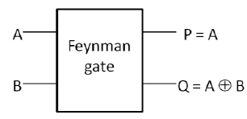

# Reversible Logic Gates

Welcome to the Reversible Logic Gates repository! This repository provides a collection of reversible logic gates implemented using various hardware description languages. Each gate is accompanied by a description of its functionality and a corresponding gate schematic for reference.

## Feynman Gate

Description: The Feynman Gate is a reversible logic gate that swaps the second and third inputs if the first input is in the state |0⟩. If the first input is in the state |1⟩, it leaves the second and third inputs unchanged.

## Double Feynman Gate

Description: The Double Feynman Gate is a reversible logic gate that swaps the second and third inputs if the first input is in the state |0⟩. If the first input is in the state |1⟩, it swaps the fourth and fifth inputs.

## Toffoli Gate

Description: The Toffoli Gate, also known as the Controlled-Controlled-NOT (CCNOT) Gate, is a three-input gate that flips the third input if both the first and second inputs are in the state |1⟩. Otherwise, it leaves the third input unchanged.

## Peres Gate

Description: The Peres Gate is a three-input gate that flips the third input if the first and second inputs are in the same state. Otherwise, it leaves the third input unchanged.

## Contributing

Contributions to this repository are welcome! If you have additional reversible logic gate implementations or improvements to existing ones, feel free to open a pull request. Please ensure that your contributions adhere to the following guidelines:

- Follow a clear and concise coding style.
- Provide the gate schematic and a brief description for each gate implementation.
- Update the README.md file with the new gate's description and schematic.

## License

This repository is licensed under the [MIT License](LICENSE).
